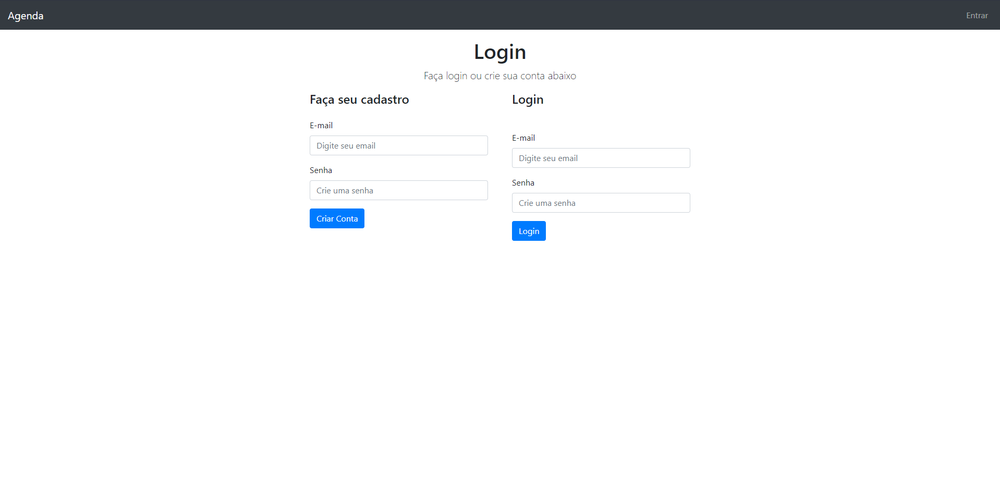
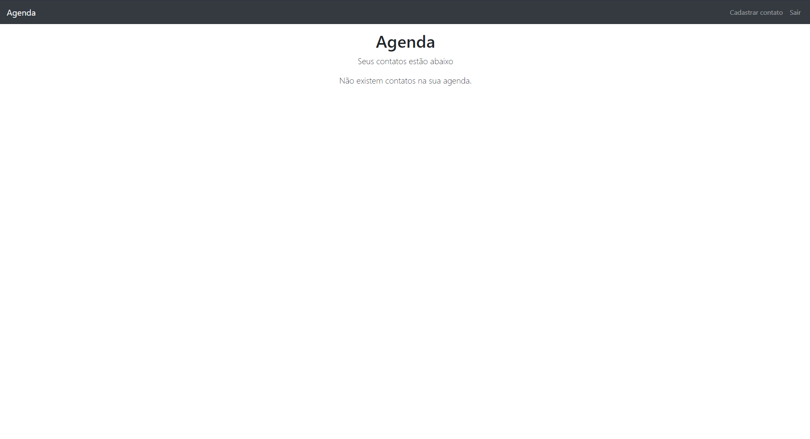

Projeto Agenda com algumas bibliotecas do node como express, validator, csurf token para colocar em hash as senhas salvas, utilizando sistema de login com verificação no banco de dados(Mongo DB) e salvamento de senhas com hash, validação frontend utilizadno o webpack.

Criação de contato com verificação de cada campo, permitindo salvar e se já quiser alterar na hora que salva, tela index com a listagem de todos os contatos salvo no banco, te permitindo alterar o contato e excluir.

Navbar com links  Agenda que mostra todos os contatos, sair que só é mostrado se a pessoa estiver logado, entrar e cadastrar contato que so aparece tambem se a pessoa estiver logada no sistema.

 
 

 

 

